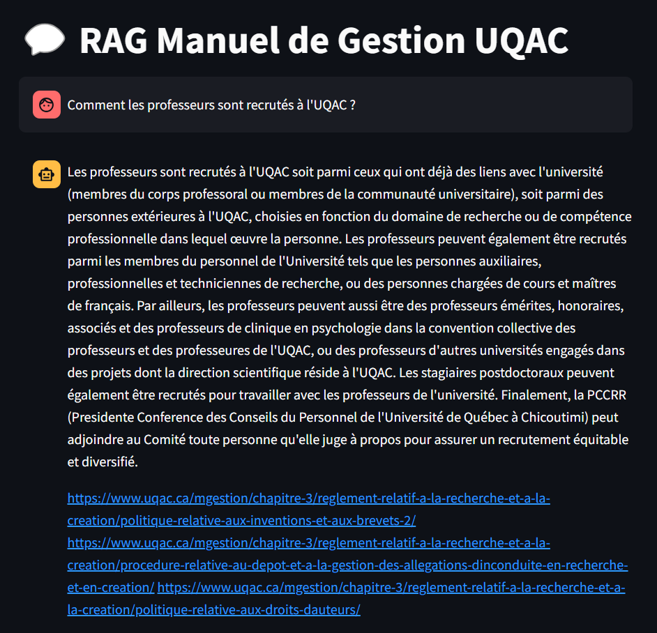

# Chatbot with Mistral 7B

In this project I created a chatbot using the Mistral 7B LLM. 
The chatbot is able to answer questions about a documents corpus. 
It first retrieves the most relevant information from the corpus using embeddings 
and then it gives the question + the information to the LLM so it can answer and cite the documents it used.
The corpus used is the [manuel de gestion de l'UQAC](https://www.uqac.ca/mgestion/) (It is the management manual of the UQAC university, written in french).

The UI has been made with streamlit, you can test it by running the following command in the terminal
`streamlit run main.py`
AS the chatbot is running locally, it can take a minute or more to answer depending on you computer performance.

## Demo


## Setup
You need to intall the ollama app at [https://ollama.com/download](https://ollama.com/download) then on terminal run the following commands to download the mistral 7B LLM and the embeddings model
```
ollama pull mistral
```
```
ollama pull nomic-embed-text
```

To download all the required packages run the following command
```
pip install -r requirements.txt
```